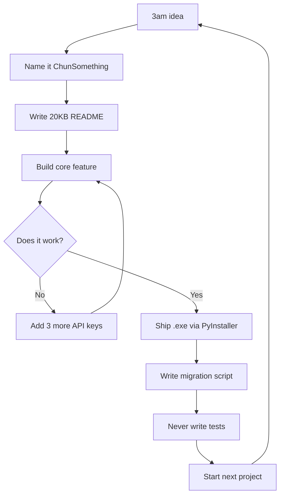

<!-- Header -->

  

<!-- Typing Animation -->

  

<!-- Social / Contact -->

  
  
  

---

## The Chun-Industrial Complex

Hi. I'm Chun. I build local-first AI tools with more READMEs than unit tests. My codebase is 53 repositories of "what if I made this, but with more API keys?" Every project starts with "Chun" because branding is hard and consistency is a coping mechanism.

I don't do cloud-first. I don't do serverless. I do "runs-on-my-laptop-and-maybe-yours-if-you-have-Docker." My database of choice is SQLite. My deployment target is a Windows `.exe` built at 4am via PyInstaller. My design system is glassmorphism because I like my UIs like I like my coffee: unnecessarily translucent.

---

## Technology Arsenal

  

  
<b>Full Stack Breakdown</b>

   

  **Languages & Runtime**
  

    
    
    
    
  

  **Frontend & UI**
  

    
    
    
    
  

  **Backend & APIs**
  

    
    
    
  

  **Data & Vector Search**
  

    
    
    
    
  

  **Desktop & Distribution**
  

    
    
    
  

  **Media & CV**
  

    
    
  

---

## Featured Projects

<table>
  <tr>
    <td width="50%" valign="top">
      <h3>ChunRP</h3>
      
      
<strong>Node.js, SvelteKit, SQLite, sqlite-vec, Electron, Docker</strong>

      
Local-first roleplay chat where your AI companion remembers that embarrassing thing you said 47 messages ago. Features vector memory, reranking, memory recycling, and enough API key rotation to make a DevOps engineer cry. Optional Turso sync for when you want your cringe available everywhere.

      

        
        
      

    </td>
    <td width="50%" valign="top">
      <h3>ChunRAG</h3>
      
      
<strong>Node.js, Express, Vectra, Electron, multi-provider LLMs</strong>

      
Upload your documents and yell questions at them. Supports 7 color themes because I couldn't pick one. Uses Vectra for vector search, which is just JSON files pretending to be a database. Electron build included so you can pretend it's a native app.

      

        
        
      

    </td>
  </tr>
  <tr>
    <td width="50%" valign="top">
      <h3>ChunScraper</h3>
      
      
<strong>Python, FastAPI, SSE, Gemini, Botasaurus</strong>

      
AI writes your scrapers so you don't have to. Give it a URL, watch it fail 4 times, then succeed on the 5th attempt. It's not buggy; it's "iteratively self-correcting." Built with FastAPI and enough Gemini keys to power a small nation.

      

        
        
      

    </td>
    <td width="50%" valign="top">
      <h3>Chun-MediaConv</h3>
      
      
<strong>Python, PySide6, FFmpeg, PyInstaller</strong>

      
Professional media converter that detects your GPU then immediately asks if you're sure you want to use it. Batch queues, presets, and a Sage Green color scheme that screams "I am a serious tool for serious people." PyInstaller build because installers are for cowards.

      

        
        
      

    </td>
  </tr>
  <tr>
    <td width="50%" valign="top">
      <h3>ChunDiet</h3>
      
      
<strong>Flask, SQLite, Gemini, Docker, Windows EXE</strong>

      
Tell it you ate "a sad sandwich" and it tells you exactly how sad your life choices are. Natural language nutrition tracking with Gemini, SQLite, and a Windows .exe that your antivirus definitely trusts. Docker support included for people who containerize their lunch.

      

        
        
      

    </td>
    <td width="50%" valign="top">
      <h3>llm_rotationJS</h3>
      
      
<strong>ESM, Node.js, OpenRouter, Gemini, Mistral, Cohere, NVIDIA, Hugging Face</strong>

      
The one library I actually extracted instead of copy-pasting into 6 different repos. Multi-provider LLM routing with automatic key rotation and status tracking. Supports 8+ providers because vendor lock-in is for people with budgets and dignity.

      

        
        
      

    </td>
  </tr>
</table>

---

## Supporting Work (The B-Sides)

| Repository | Focus | Why It Exists |
| --- | --- | --- |
| [`better_genai`](https://github.com/Chungus1310/better_genai) | Python + FastAPI + WebSocket | Gemini wrapper with encryption, key rotation, caching, and streaming. Basically a spa day for your API keys. |
| [`llm_api_wrapper`](https://github.com/Chungus1310/llm_api_wrapper) | Python + Flask | Multi-provider LLM wrapper with standardized responses. The Python cousin of llm_rotationJS. They don't talk at family reunions. |
| [`meezaref_studio`](https://github.com/Chungus1310/meezaref_studio) | PyQt6 + OpenCV + NumPy | Image reference workspace with layers and optional GPU acceleration. For artists who need 47 reference images open at once. |
| [`wordleDestroyer`](https://github.com/Chungus1310/wordleDestroyer) | HTML/CSS/JS | Entropy-based Wordle solver. Uses math to ruin a fun word game. Deployed on GitHub Pages because it's literally just HTML. |
| [`linux_portfolio`](https://github.com/Chungus1310/linux_portfolio) | TypeScript + Express + Webpack | Terminal-style portfolio with fake filesystem commands. `ls` your way into unemployment. |
| [`powerRAG`](https://github.com/Chungus1310/powerRAG) | Python + discord.py + ChromaDB | Discord bot that answers questions from a PDF. Turns your company's HR handbook into an interactive nightmare. |
| [`ChunTTS`](https://github.com/Chungus1310/ChunTTS) | Python + PyQt6 + gTTS/edge-tts | Desktop TTS workstation. Because reading is hard and listening to robots is easier. |
| [`easy_discord_slash`](https://github.com/Chungus1310/easy_discord_slash) | Python + discord.py | Decorators for slash commands. I got tired of typing boilerplate so I typed different boilerplate. |

---

## GitHub Analytics

&nbsp;&nbsp;

  

---

## Vital Signs

  
  
  
  
  
  

  

---

> "I don't always test my code, but when I do, I do it in production."  
> — Me, probably, at 3am, while shipping another PyInstaller build

  Built with spite, caffeine, and an unhealthy relationship with SQLite.

<!-- Footer -->

  

